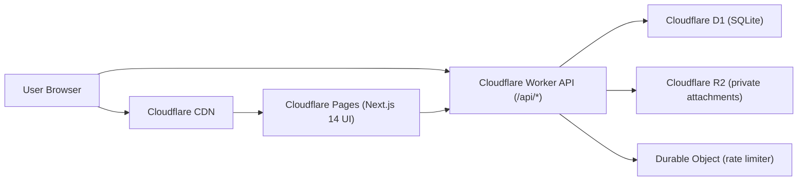

# SMART WORK TRACKER Architecture

## 1) High-Level System Diagram

## 2) Data Flow
1. User authenticates at `/api/auth/register|login`; Worker sets secure HttpOnly JWT cookies.
2. UI calls Worker APIs with cookie-based session (`credentials: include`).
3. Worker enforces auth + RBAC (self-write, supervisor-read), validates payloads, and writes to D1.
4. Attachment uploads are validated then stored in private R2; file metadata is persisted in D1.
5. UI requests short-lived signed URLs for preview/download.
6. Monthly report endpoint computes summaries from activities/work plans and exports PDF/Word/Excel-compatible output.

## 3) Runtime Boundaries
- `apps/web`: Next.js 14 frontend, deployed to Cloudflare Pages.
- `apps/api-worker`: Hono-based API on Cloudflare Workers.
- `db/migrations`: D1 schema and analytical views.
- `packages/shared-types`: shared API contracts and DTOs used by web + worker.

## 4) Security Model
- Access token (15 min) + refresh token (30 days) in `HttpOnly Secure SameSite=Lax` cookies.
- Password hashing with `bcryptjs` (cost 12).
- Rate limiting via Durable Object keyed by user ID / IP.
- Upload constraints: allowlist MIME + extension and max size 10MB.
- Private bucket access only through signed short-lived Worker URL tokens.
